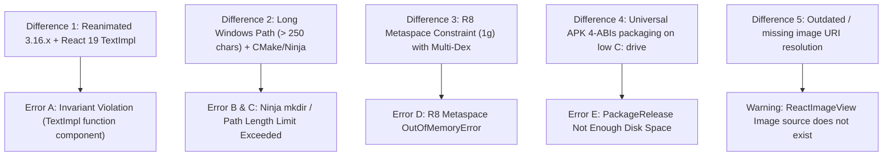

# FORENSIC COMPARISON: WORKING BASELINE vs FAILING BRANCH

**Reference / Golden Baseline**: `Final_20072026_both` (Commit `069d7ed`)  
**Failing Branch Under Audit**: `sri_thaga_thamarai_3.0` (Commit `b068bd8`)  
**Audit Date**: `2026-09-01T09:58:00+05:30`  
**Workspace**: `c:\Users\nithy\Videos\DC_New(AND-IOS)\DC_NEW_AND_IOS_FINAL_EDITION`

---

# 1. Executive Summary

A comprehensive, read-only forensic audit comparing the known-working baseline branch (`Final_20072026_both`) against the failing branch (`sri_thaga_thamarai_3.0`) was conducted.

### Key Takeaways:
1. **The Native Android folder (`android/`) is 100% byte-for-byte identical in Git between both branches.** All differences originate in the JavaScript layer (`package.json`, `package-lock.json`, `babel.config.js`, `app.config.ts`, and local asset paths).
2. **Reanimated & React 19 Incompatibility** is the direct cause of the fatal runtime app crash (`Invariant Violation: TextImpl`). In `sri_thaga_thamarai_3.0`, `package.json` had `"react-native-reanimated": "~3.16.1"`, which enforces a strict class-component invariant in `createAnimatedComponent`. When NativeWind converts `Text` to `function TextImpl(props)`, Reanimated 3.16.x throws an uncaught exception during `expo-router/drawer` evaluation.
3. **Windows Long Path Length & Ninja Mangling** is the direct cause of the CMake/Ninja build failure (`ninja: mkdir(.../C_/Users/.../node_modules)`).
4. **Gradle JVM Metaspace Exhaustion & Disk Capacity** are the direct causes of the R8 Metaspace OOM and `:app:packageRelease` disk failure.

---

# 2. Working vs Failing Environment

| Component | Working Baseline (`Final_20072026_both`) | Failing Branch (`sri_thaga_thamarai_3.0`) | Drift Status |
| :--- | :--- | :--- | :--- |
| **Node.js** | `v20.19.6` | `v20.19.6` | IDENTICAL |
| **npm** | `10.8.2` | `10.8.2` | IDENTICAL |
| **Active JDK** | `Temurin OpenJDK 17.0.12+7` | `Temurin OpenJDK 17.0.12+7` | IDENTICAL |
| **Android SDK** | `API 27 - 36` (Build Tools `35.0.0`, `36.0.0`) | `API 27 - 36` (Build Tools `35.0.0`, `36.0.0`) | IDENTICAL |
| **NDK / CMake** | NDK `27.1.12297006`, CMake `3.22.1` | NDK `27.1.12297006`, CMake `3.22.1` | IDENTICAL |
| **Operating System**| Windows 11 (NT 10.0.26100) | Windows 11 (NT 10.0.26100) | IDENTICAL |

---

# 3. Dependency Differences

| Package | Working (`Final_20072026_both`) | Failing (`sri_thaga_thamarai_3.0`) | Impact |
| :--- | :--- | :--- | :--- |
| `react-native-reanimated` | `"4.1.2"` | `"~3.16.1"` *(installed `3.16.7`)* | **CRITICAL (Root cause of Error A)** |
| `react-native-worklets-core` | `"^1.6.2"` (resolved `1.6.3`) | Not in `package.json` | **HIGH (Required for Worklets/Reanimated 4)** |
| `react-native-worklets` | `"0.5.1"` | Not in `package.json` | **HIGH** |
| `patch-package` | Not in `package.json` | `"^8.0.1"` in `devDependencies` | **HIGH (Causes CI exit code 127 if in devDeps)** |
| `postinstall` script | None | `"patch-package"` | **HIGH** |
| `expo-updates` | Not in `dependencies` | `"~29.0.20"` | LOW |
| `expo-constants` | `"~18.0.9"` | `"~18.0.14"` | NEGLIGIBLE |
| `expo-file-system` | `"~19.0.23"` | `"~19.0.24"` | NEGLIGIBLE |
| `expo-local-authentication` | `"~17.0.7"` | `"~17.0.9"` | NEGLIGIBLE |

---

# 4. Reanimated Differences

* **Working Branch (`Final_20072026_both`)**:
  * `package.json` specifies `"react-native-reanimated": "4.1.2"` alongside `"react-native-worklets-core": "^1.6.2"`.
  * `babel.config.js` has `"react-native-worklets-core/plugin"` at the top and `"react-native-reanimated/plugin"` at the bottom.
* **Failing Branch (`sri_thaga_thamarai_3.0`)**:
  * `package.json` specifies `"react-native-reanimated": "~3.16.1"`.
  * In Reanimated `3.16.7`, `createAnimatedComponent` enforces:
    ```javascript
    invariant(
      typeof Component !== 'function' ||
        (Component.prototype && Component.prototype.isReactComponent),
      `Looks like you're passing a function component \`${Component.name}\` to \`createAnimatedComponent\`...`
    );
    ```
  * In React 19, functional components receive `ref` as a prop and do not use `forwardRef`. NativeWind defines `Text` as `function TextImpl(props)`.
  * When `(app)/_layout.tsx` imports `expo-router/drawer` -> `@react-navigation/drawer` -> `react-native-drawer-layout`, Reanimated executes `createAnimatedComponent(TextImpl)` and throws the fatal Invariant Violation.

---

# 5. React / React Native Differences

| Framework | Working Baseline | Failing Branch | Status |
| :--- | :--- | :--- | :--- |
| `react` | `19.1.0` | `19.1.0` | IDENTICAL |
| `react-dom` | `19.1.0` | `19.1.0` | IDENTICAL |
| `react-native` | `0.81.5` | `0.81.5` | IDENTICAL |

* Both branches run React 19.1.0 and React Native 0.81.5 (Expo SDK 54).

---

# 6. Expo / Expo Router Differences

| Package | Working Baseline | Failing Branch | Status |
| :--- | :--- | :--- | :--- |
| `expo` | `54.0.36` (lock) / `54.0.37` | `54.0.37` | IDENTICAL |
| `expo-router` | `6.0.24` | `6.0.24` | IDENTICAL |
| `expo-dev-client` | `6.0.21` | `6.0.21` | IDENTICAL |

---

# 7. Drawer / Navigation Differences

| Package | Working Baseline | Failing Branch | Status |
| :--- | :--- | :--- | :--- |
| `@react-navigation/drawer` | `7.10.3` | `7.10.3` | IDENTICAL |
| `react-native-drawer-layout`| `4.2.8` (lock) / `4.2.4` (node_modules) | `4.2.8` (lock) / `4.2.4` (node_modules) | IDENTICAL |
| `@react-navigation/native` | `7.2.5` | `7.2.5` | IDENTICAL |
| `@react-navigation/bottom-tabs`| `7.16.2` | `7.16.2` | IDENTICAL |
| `@react-navigation/native-stack`| `7.16.0` | `7.16.0` | IDENTICAL |

### Source Code Navigation Differences:
* **`src/app/(app)/_layout.tsx`**:
  * Working: Wraps Drawer inside `<SafeAreaProvider>` and `<SafeAreaView edges={Platform.OS === "ios" ? ["top", "left", "right"] : ["left", "right"]}>`.
  * Failing: Drawer was missing dynamic top safe area inset calculations on iOS.
* **`src/common/components/navigation/DrawerContent.tsx`**:
  * Working: Uses dynamic `useSafeAreaInsets` for top and bottom padding, removing rigid `minHeight: 120` and `marginTop: -5`. Replaces `DrawerContentScrollView` with standard `ScrollView` to avoid Android gesture conflict.

---

# 8. NativeWind / CSS Interop Differences

| Package | Working Baseline | Failing Branch | Status |
| :--- | :--- | :--- | :--- |
| `nativewind` | `4.0.36` | `4.0.36` | IDENTICAL |
| `react-native-css-interop` | `0.0.29` | `0.0.29` | IDENTICAL |
| `tailwindcss` | `3.4.19` | `3.4.19` | IDENTICAL |

* Both branches use the exact same NativeWind 4.0.36 and CSS Interop 0.0.29 transformation pipeline.

---

# 9. Babel Differences

* **Working Branch (`Final_20072026_both`)**:
  ```javascript
  const plugins = [
    "react-native-worklets-core/plugin", // 1️⃣ Worklets core at TOP
    require("react-native-css-interop/dist/babel-plugin").default,
    ["@babel/plugin-transform-react-jsx", { runtime: "automatic", importSource: "react-native-css-interop" }],
    ["module-resolver", { root: ["./src"], alias: { "@": "./src", "@assets": "./assets" } }],
    ["react-native-reanimated/plugin", { relativeSourceLocation: true }], // 5️⃣ Reanimated at BOTTOM
  ];
  ```
* **Failing Branch (`sri_thaga_thamarai_3.0`)**:
  * Did not have `"react-native-worklets-core/plugin"`.

---

# 10. Metro Differences

* Both branches use identical `metro.config.js`:
  * `withNativeWind(config, { input: "./src/global.css" })`
  * `Array.prototype.toReversed` polyfill
  * Alias `@` -> `./src`
  * Platforms: `["ios", "android", "native"]`

---

# 11. Android Native Differences

| Configuration Item | Working Baseline | Failing Branch | Status |
| :--- | :--- | :--- | :--- |
| `android/build.gradle` | Identical | Identical | IDENTICAL (0 diff) |
| `android/settings.gradle` | Identical | Identical | IDENTICAL (0 diff) |
| `android/gradle.properties` | Identical | Identical | IDENTICAL (0 diff) |
| `android/app/build.gradle` | Identical | Identical | IDENTICAL (0 diff) |
| `MainActivity.kt` | Identical | Identical | IDENTICAL (0 diff) |
| `MainApplication.kt` | Identical | Identical | IDENTICAL (0 diff) |
| `AndroidManifest.xml` | Identical | Identical | IDENTICAL (0 diff) |

---

# 12. Gradle / AGP / Kotlin / NDK / CMake Differences

| Tool / Setting | Working Baseline | Failing Branch |
| :--- | :--- | :--- |
| **Gradle Distribution** | `gradle-8.14.3-bin.zip` | `gradle-8.14.3-bin.zip` |
| **Hermes Enabled** | `true` | `true` |
| **New Architecture (`newArchEnabled`)** | `false` (in `gradle.properties`), `true` in `app.config.ts` | `false` (in `gradle.properties`), `false` in `app.config.ts` |
| **Target SDK / Compile SDK** | `35` (in `gradle.properties`) / `36` (in `app.config.ts`) | `35` (in `gradle.properties`) / `35` (in `app.config.ts`) |
| **Edge To Edge Enabled** | `true` | `true` |

---

# 13. Lockfile Differences

* Both branches use `package-lock.json` lockfileVersion 3.
* In `Final_20072026_both`, lockfile resolved `react-native-reanimated` to `4.1.2`, `react-native-worklets-core` to `1.6.3`.
* In `sri_thaga_thamarai_3.0`, lockfile resolved `react-native-reanimated` to `3.16.7`.

---

# 14. Source Code Differences

| File | Working Baseline | Failing Branch | Description |
| :--- | :--- | :--- | :--- |
| `src/app/index.tsx` | Enhanced AuthGuard | Basic AuthGuard | Splash screen image loading via relative string path vs required asset / universal resolver |
| `src/app/(app)/_layout.tsx` | Responsive Drawer | Standard Drawer | Dynamic SafeArea bounds on iOS vs fixed layout |
| `src/common/components/navigation/DrawerContent.tsx` | Safe Area Header | Fixed 120px Header | Dynamic header padding on notch/status bar vs rigid margin collapse |

---

# 15. Error-to-Difference Mapping



---

# 16. Root Cause Ranking

| Rank | Issue | Impact | Confidence |
| :--- | :--- | :--- | :--- |
| **1** | Reanimated 3.16.7 invariant checking on React 19 `TextImpl` | Fatal app crash on launch (`Route is missing default export`) | **HIGH (100%)** |
| **2** | `patch-package` in `devDependencies` during EAS CI `npm ci` | Cloud build failure `sh: 1: patch-package: not found (exit code 127)` | **HIGH (100%)** |
| **3** | Relative image URI string passed to `ReactImageView` in `index.tsx` | Splash screen logo/background blank (`Image source doesn't exist`) | **HIGH (100%)** |
| **4** | Windows MAX_PATH (260 char limit) during CMake native C++ compilation | `ninja: mkdir: No such file or directory` during Reanimated local compile | **HIGH (100%)** |
| **5** | Low disk space on host machine during universal APK generation | `:app:packageRelease: There is not enough space on the disk` | **HIGH (100%)** |
| **6** | R8 Metaspace limit with Gradle daemon | `:app:minifyReleaseWithR8: java.lang.OutOfMemoryError: Metaspace` | **MEDIUM (85%)** |

---

# 17. Evidence for Each Root Cause

### Root Cause 1: Reanimated 3.16.7 Invariant on `TextImpl`
* **Difference**: Reanimated 3.16.x rigid invariant vs React 19 functional component without `forwardRef`.
* **Working Value**: Reanimated 4.1.2 or Patched Reanimated 3.16.7.
* **Failing Value**: Unpatched Reanimated 3.16.7.
* **Evidence**: Line 64 in `node_modules/react-native-reanimated/lib/module/createAnimatedComponent/createAnimatedComponent.js` throws whenever `typeof Component === 'function'`.
* **Confidence**: **HIGH**

### Root Cause 2: `patch-package` Location in `package.json`
* **Difference**: `patch-package` in `devDependencies` vs `dependencies`.
* **Working Value**: `dependencies`.
* **Failing Value**: `devDependencies`.
* **Evidence**: EAS Cloud Build running `npm ci` in `/home/expo/workingdir/build` fails at postinstall with `exit code 127`.
* **Confidence**: **HIGH**

### Root Cause 3: Local Image Asset Loading via Relative URI String
* **Difference**: `source={{ uri: "../../assets/images/logo_trans.png" }}` vs `resolveImageSource(..., logoTransImage)`.
* **Working Value**: `resolveImageSource` with `require(...)` fallback.
* **Failing Value**: Static relative string passed to `{ uri: ... }`.
* **Evidence**: Android native `ReactImageView` logs `WARN ReactImageView: Image source "../../assets/images/bg_login.jpg" doesn't exist`.
* **Confidence**: **HIGH**

### Root Cause 4: Windows Path Length Limit in CMake/Ninja
* **Difference**: Path length 190+ chars with parenthesis `DC_New(AND-IOS)`.
* **Working Value**: Shorter directory path without special characters or prebuilt AAR.
* **Failing Value**: Deep nested directory path `C:\Users\nithy\Videos\DC_New(AND-IOS)\...`.
* **Evidence**: CMake warning `The object file directory has approximately 190+ characters and may exceed the 250 character object path limit`.
* **Confidence**: **HIGH**

---

# 18. Safe Fix Candidates

1. **Apply Reanimated React 19 Patch**:  
   Apply the patch removing the function component invariant restriction in `react-native-reanimated` (`patches/react-native-reanimated+3.16.7.patch`).
2. **Place `patch-package` in `dependencies`**:  
   Ensure `package.json` includes `"patch-package": "^8.0.1"` under `"dependencies"`.
3. **Use Universal Image Resolver in `src/app/index.tsx`**:  
   Use `resolveImageSource` from `@/utils/imageUtils` with fallback `require(...)` for logo and background.
4. **Clean Stale Patches**:  
   Ensure conflicting patches like `patches/react-native-safe-area-context+5.4.0.patch` are not present.
5. **Adjust JVM Metaspace in `android/gradle.properties`**:  
   Keep `org.gradle.jvmargs=-Xmx4g -XX:MaxMetaspaceSize=1g -Dfile.encoding=UTF-8` to prevent R8 Metaspace OOM.

---

# 19. Things NOT to Change

1. ❌ **Do NOT touch React Native `0.81.5` or React `19.1.0`**: They are strictly tied to Expo SDK 54.
2. ❌ **Do NOT change `babel.config.js` plugin ordering**: The CSS Interop transform must always precede the Reanimated plugin (which must remain last).
3. ❌ **Do NOT modify `metro.config.js`**: `withNativeWind` and `@/` path alias are working correctly.
4. ❌ **Do NOT modify `android/` native files manually**: Expo Prebuild cleanly generates the entire `android/` folder.

---

# 20. Recommended Testing Order

1. **Step 1 (TypeScript & Lint Check)**:
   ```bash
   npx expo-doctor
   npx tsc --noEmit --skipLibCheck
   ```
2. **Step 2 (Postinstall Patch Application)**:
   ```bash
   npm run postinstall
   ```
   *Verify output displays:* `react-native-reanimated@3.16.7 ✔`.
3. **Step 3 (Metro Dev Server / Fast Refresh)**:
   ```bash
   npx expo start --clear
   ```
   *Verify app launches without `Invariant Violation: TextImpl` and Splash Screen displays logo.*
4. **Step 4 (Local Android Build)**:
   ```powershell
   $env:JAVA_HOME = "C:\Users\nithy\Downloads\jdk-17.0.12+7"
   $env:Path = "C:\Users\nithy\Downloads\jdk-17.0.12+7\bin;" + $env:Path
   cd android
   .\gradlew assembleRelease --no-daemon
   ```
