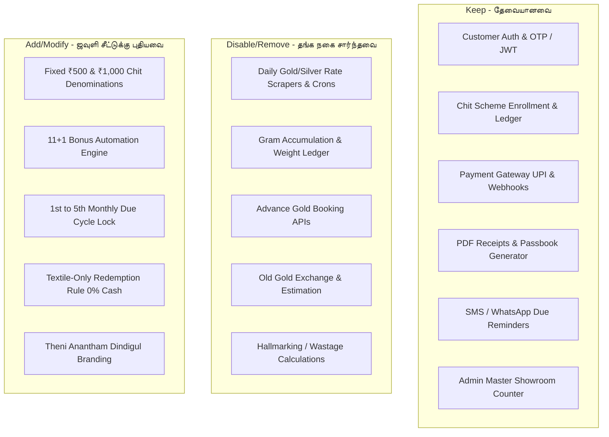

# Theni Anantham (Dindigul) – Backend & Frontend Master Implementation Plan

**Client**: Theni Anantham Textiles (தேனி ★ ஆனந்தம் - திண்டுக்கல்)  
**Testing Domain**: `nexooai.in`  
- Backend API: `https://api.prod.nexooai.in`  
- Frontend Master: `https://master.nexooai.in`  
**Mobile App Base URL**: `https://api.prod.nexooai.in` (Configured & Committed)  
**Target Scheme**: Deepavali Annual Chit Scheme ("தீபாவளி வருடாந்திர சீட்டு" – ₹500 & ₹1,000 / 11+1 Months)  

---

## 1. Safety & Architecture Isolation Principles

> [!IMPORTANT]
> **Zero Impact on Existing Gold Savings Schemes (தங்க சேமிப்பு திட்டங்களில் எந்த பாதிப்பும் ஏற்படாது):**  
> Existing live operations (Kanisaa / Jeyabala / DC Jewellers) are running in production. Any direct modification to existing branches, ports, or databases could crash or alter gold savings data.  
> Therefore, strict branch, port, database, and process separation must be maintained.

### Isolation Strategy:
1. **Branch Segregation**:
   - Backend (`api core`): Clone current live branch -> `theni_anandham_textiles`
   - Frontend Master (`master`): Clone current live branch -> `theni_anandham_textiles`
2. **Process & Port Segregation**:
   - Backend API: Run on a dedicated port (e.g., `PORT 5050`) separate from gold backend (`PORT 5000`).
   - Frontend Master: Run on a dedicated port (e.g., `PORT 3050`) separate from gold master (`PORT 3000`).
3. **Domain & Reverse Proxy Routing**:
   - `api.prod.nexooai.in` -> Reverse proxy (Nginx / Cloudflare) -> `localhost:5050`
   - `master.nexooai.in` -> Reverse proxy (Nginx / Cloudflare) -> `localhost:3050`
4. **Database Segregation**:
   - Dedicated database/schema (e.g. `theni_anantham_db`) so customer data, schemes, and chit records never mix with jewellery transactions.

---

## 2. Module Breakdown: What to Keep, Remove, and Add



---

## 3. Detailed Component Plan

### A. What to Keep (அப்படியே வைத்திருக்க வேண்டியவை)
| Module | Purpose | Status in Theni Anantham |
| :--- | :--- | :--- |
| **Auth System** (`/auth/*`) | Customer mobile check, OTP SMS verification, JWT token refresh, Logout | **Active (No change)** |
| **Customer Profile** (`/user/*`) | User registration, name, address, profile photo upload, FCM device token push | **Active (No change)** |
| **Chit Scheme Management** (`/investments/*`) | Scheme enrollment, monthly installment tracking, passbook balance | **Active (Mapped to Chit)** |
| **Payment Gateway** (`/payments/*`) | Razorpay / Cashfree UPI order creation, webhook verification, payment status | **Active** |
| **Receipt & Invoicing** | PDF bill generation with transaction ID, customer details, installment number | **Active (Branded for Theni)** |
| **Notifications** (`/notifications/*`) | Due reminders, payment confirmation, festive announcements | **Active** |
| **Master Admin Portal** | Customer search, manual offline payment collection at showroom counter, reconciliation reports | **Active** |

---

### B. What to Remove / Disable (தங்க நகை சார்ந்த தேவையில்லாதவை)
*Do not delete database columns abruptly; disable endpoints and hide corresponding UI tabs on the master frontend:*

1. **Gold & Silver Rate Engine**:
   - Disable scrapers and cron jobs fetching daily 22K/24K gold rates.
   - Disable `/gold-rates`, `/metal-rates` endpoints.
2. **Weight Accumulation Logic**:
   - In jewellery schemes, ₹1,000 paid is converted into grams (e.g. `0.142 g` of gold).
   - In Theni Anantham, this is strictly a **Rupee Chit Scheme**. Disable all gram-weight calculations.
3. **Advance Gold Booking**:
   - Disable `/advancebookings` endpoints (Fixing gold rate for future purchase).
4. **Old Gold Exchange Calculator**:
   - Remove jewellery estimation and exchange tools.
5. **Hallmark & Wastage / Making Charges**:
   - Remove BIS hallmark validation, VA (Value Addition), and MC (Making Charge) master tables.

---

### C. What to Add / Modify (புதிதாக சேர்க்க / மாற்ற வேண்டியவை)

1. **Textile Chit Scheme Configuration**:
   - Plan Name: **தீபாவளி வருடாந்திர சீட்டு (Deepavali Annual Chit Scheme)**
   - Monthly Installments: **₹500** or **₹1,000**
   - Tenure: **11 Months** (Customer pays 11 dues)
   - Bonus: **12th Month Incentive Bonus** (Contributed by Theni Anantham)
     - For ₹500/month plan: Total Customer Paid = ₹5,500 + Bonus ₹500 = **₹6,000 Total**
     - For ₹1,000/month plan: Total Customer Paid = ₹11,000 + Bonus ₹1,000 = **₹12,000 Total**
2. **Due Date & Grace Period Engine**:
   - Monthly payment window: **1st to 5th of every month**.
   - Automated reminder trigger on the 1st of each month.
   - Late payment warning badge if paid after the 5th.
3. **Textile Redemption Contract**:
   - Passbook and receipts must state: *"ரொக்கமாக திருப்பி தரப்பட மாட்டாது. முதிர்வுத் தொகைக்கு திண்டுக்கல் கிளையில் ஆடை மற்றும் ஜவுளிகள் மட்டுமே எடுத்துக்கொள்ள இயலும்."* (Strictly textile redemption, zero cash refund).
4. **Receipt & Master Invoice Templates**:
   - Update showroom header: **Theni Anantham, Main Road, Dindigul**.
   - Include company GSTIN, Dindigul jurisdiction clause, and Deepavali Chit Scheme rules.

---

## 4. Execution Roadmap (Step-by-Step)

```
Step 1: Mobile App Alignment (COMPLETED ✅)
  └── Base URL set to https://api.prod.nexooai.in
  └── Dedicated TextileHomePage implemented & tested

Step 2: Git Branching in Backend & Master Repos
  └── git checkout -b theni_anandham_textiles (from live/production)
  └── Lock branches to avoid unintended merges

Step 3: Port & Environment (.env) Setup
  └── Backend .env: PORT=5050, DB_NAME=thenianantham_db, DOMAIN=api.prod.nexooai.in
  └── Master .env: PORT=3050, REACT_APP_API_URL=https://api.prod.nexooai.in

Step 4: Nginx / Reverse Proxy Routing
  └── api.prod.nexooai.in  -> localhost:5050
  └── master.nexooai.in    -> localhost:3050

Step 5: Code Adjustments (Disable Gold / Configure Textile Chits)
  └── Suppress gold rate crons
  └── Configure ₹500 & ₹1000 11+1 chit rules

Step 6: End-to-End Testing & Customer Demo
  └── Test mobile app OTP login, chit enrollment, and test UPI payment
  └── Verify transaction in Master Portal
  
Step 7: Production Migration (Once client provides live domain)
  └── Update DNS to point thenianantham.com to live server
  └── Update DOMAIN in .env and theme.config.js (Zero downtime)
```
