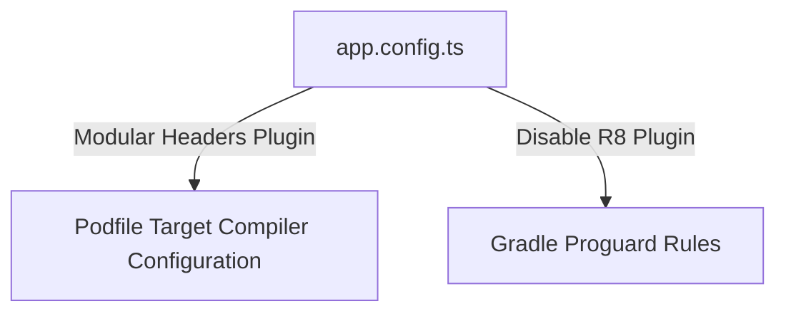
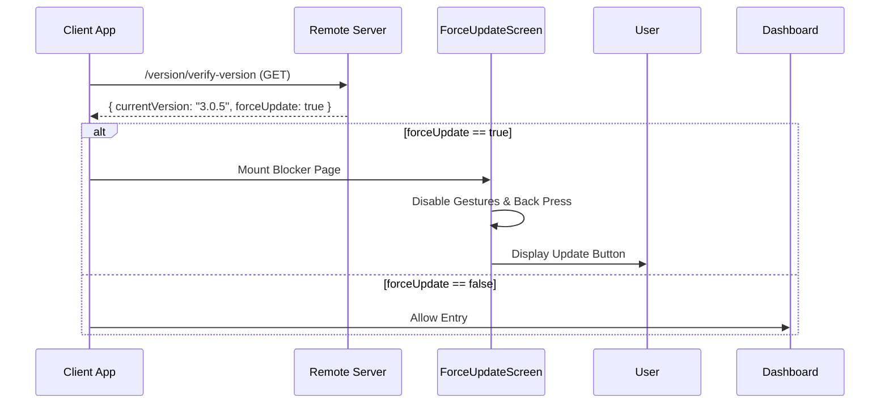

# Deployment, Build & Maintenance

This document details the configuration patterns, custom native build plugins, and remote application management protocols implemented for the DC Jewellers Mobile App.

---

## 🏗️ 1. EAS Build Pipeline & Configuration

The application uses Expo Application Services (EAS) for build generation. Configurations are managed in `eas.json` in the root directory.

### Environment Variable Injection:
For API keys that should not be committed to public codebases (e.g. Google Maps API keys), the build system injects them dynamically using environment configurations:
*   **Google Maps Integration:** The environment variable `GOOGLE_MAPS_API_KEY` is loaded inside `app.config.ts`.
*   During compilation, this variable is mapped directly to:
    *   **Android:** `manifestPlaceholders` / `<meta-data android:name="com.google.android.geo.API_KEY" .../>` inside `AndroidManifest.xml`.
    *   **iOS:** `GMSApiKey` string inside `Info.plist`.

---

## 🔌 2. Custom Expo Config Plugins

To modify native build scripts without ejecting, the app uses custom config plugins:



### iOS Modular Headers Plugin (`app.plugin.js` & `plugins/`):
*   To resolve conflicts between static swift frameworks and third-party objective-C libraries, a custom plugin replaces default target flags in the iOS Podfile with modular header flags:
    ```javascript
    // app.plugin.js
    module.exports = function withModularHeaders(config) {
      // Modifies compiler directives in iOS CocoaPods build system
    }
    ```
*   Configures plist settings to register UPI app schemes (`phonepe`, `tez`, `paytm`, `bhim`) for native payment handling.

### Android Proguard & R8 Config Plugin (`plugins/`):
*   To prevent the R8 optimizer from stripping out reflection-dependent serialization classes (such as socket client models, NetInfo status fields, or native analytics trackers) in release builds, a custom plugin:
    1.  Disables Android Gradle's R8 Full Mode.
    2.  Injects custom Proguard Keep Rules (`-keep class ...`) into the native project folder dynamically on prebuild.

---

## 📡 3. Force Update Service

To ensure users run compatible client versions, the app includes a force update service on startup.



### Technical Workflow:
*   **Version Check Hook (`hooks/useForceUpdate.ts`)**: Runs on application boot. Compares local client versions (retrieved via `expo-application`) with the server's minimum version requirements fetched from `/version/verify-version`.
*   **Overlay Screen (`components/ForceUpdateScreen.tsx`)**: If a critical update is marked as mandatory, the app displays a full-screen modal blocking user interactions. This modal disables hardware back buttons (Android) and provides navigation links to download the update from the App Store/Google Play.

---

## 🛠️ 4. Maintenance Service

Protects system integrity and user experience during server deployments or database maintenance window.

### Technical Workflow:
*   **Maintenance status verification (`services/maintenanceService.ts`)**: Periodically calls `/maintenance/status` or verifies the status during boot.
*   **Wrapper Container (`components/MaintenanceWrapper.tsx`)**: An active shell that wraps core application modules. If the server signals an outage, this wrapper locks navigation and displays a maintenance screen.
*   **Maintenance Screen (`components/MaintenanceScreen.tsx`)**: A detailed screen displaying scheduled outage information, support phone links, and a refresh button to re-evaluate server status.
