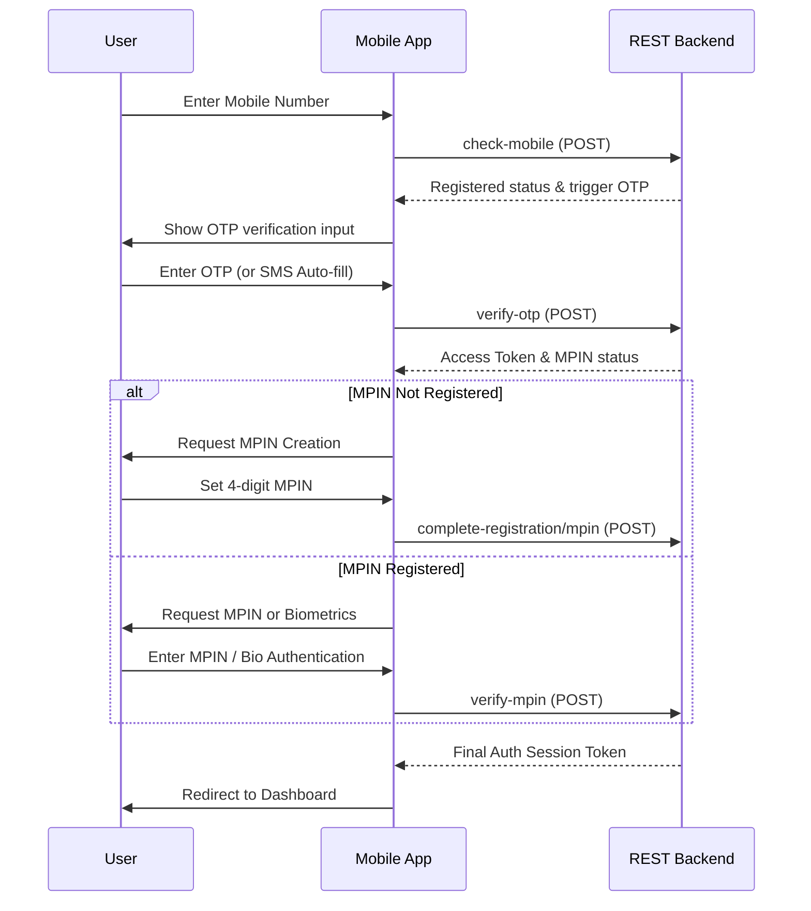
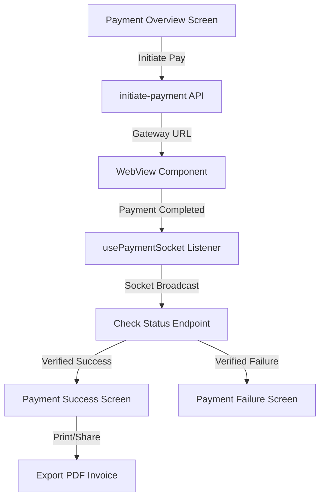

# Features & Modules Documentation

This document describes all primary features, user journeys, and screens implemented in the DC Jewellers mobile application.

---

## 🔐 1. Authentication & Security Module

The authentication lifecycle is designed for fast, secure access on mobile devices, supporting passwordless OTP login, local MPIN verification, and biometric checks.

### Key Screens & Components:
*   **Splash Slider (`intro.tsx`)**: High-fidelity promotional onboarding screen displaying the store's primary values with multilingual sliders.
*   **Login Screen (`(auth)/login.tsx`)**: Captures user mobile numbers. Automatically triggers SMS retrieval for Android users.
*   **OTP Verification Screen**: Processes OTP checks using `react-native-sms-retriever` for hands-free auto-fill verification.
*   **MPIN Setup/Verify (`(auth)/setmpin.tsx`, `(auth)/mpin_verify.tsx`)**: Prompts the user to set or input a 4-digit PIN, which is then verified against the server.
*   **Biometrics Integration (`hooks/useBiometrics.ts`)**: Integrates local face/fingerprint authentication using `expo-local-authentication` as a secure shortcut to bypass manual MPIN entry on subsequent app launches.
*   **Profile Account Controls (`(app)/(tabs)/profile.tsx`)**: Includes security features like JWT token clearing on logout and a full **Account Deactivation / Deletion** button invoking `/deactivateUser/:userId`.

---

## 💰 2. Gold Savings Schemes Module

The savings module is the core business driver, allowing users to browse savings schemes, subscribe to gold/chit plans, and track balances.

### Key Screens & Components:
*   **Dynamic Scheme Browser (`(app)/(tabs)/home/schemes.tsx`)**: Displays all active investment plans fetched from `/schemes/active`.
*   **Auto-Scroll Cards Slider (`components/DynamicSchemeCard.tsx`)**: Renders promotional layouts with swipe indicators, auto-scroll transitions (every 2 seconds), and a slide-up info modal detailing scheme rules and margins.
*   **Join Schemes Form (`(app)/(tabs)/home/join_savings.tsx`)**: Enables users to join a scheme. Auto-populates the user's name, provides dropdown lists for selecting gold branches, and performs validations.
*   **My Subscribed Schemes (`(app)/(tabs)/savings/index.tsx`)**: Retrieves the user's active schemes from `/investments/user_investments/:userId` and presents them in a detailed listing with progress indicators.
*   **Enhanced Scheme Card (`components/EnhancedSchemeCard.tsx`)**: A custom-designed container displaying individual chit statuses, due dates, transaction counts, and accumulated gold weights in grams.
*   **Savings chit details (`(app)/(tabs)/savings/SavingsDetail.tsx`)**: Provides transaction histories and due summaries. It queries `/investments/check-payment` to verify transaction statuses.

---

## 📈 3. Gold Advance Booking Module

Allows customers to lock down gold rates in advance to hedge against price volatility.

### Key Screens & Components:
*   **Advance Gold Booking Form (`(app)/gold_advance.tsx`)**: Performs booking transactions via `/advancebookings`. Fetches configurations using `/advance-booking-config` to check booking limits.
*   **Live Rate Cards (`components/LiveRateCard.tsx`, `components/GoldSilverRateCard.tsx`)**: Fetches real-time metal prices via `/rates/live` and displays current 22K/24K Gold and Silver prices per gram, with styling showing up/down market movements.
*   **Rate Chart View (`(app)/(tabs)/home/ratechart.tsx`)**: Renders high-fidelity gold/silver price charts (daily, weekly, monthly intervals) using `react-native-chart-kit` and backend data from `/rates/history`.
*   **Booking History (`(app)/(tabs)/home/BookingHistory.tsx`)**: Displays past bookings and rate-locks. Logs app events like `VIEW_BOOKING_HISTORY` for backend telemetry.

---

## 💳 4. Bill Payments & Ticket Receipts

Handles payment flows for outstanding invoices and monthly scheme chits.

### Key Screens & Components:
*   **My Bills Listing**: Fetches and details outstanding dues from `/bills/my-bills`.
*   **Payment WebView (`(app)/(tabs)/home/PaymentWebView.tsx`)**: Integrates the payment gateway securely. Features a **Cancel Button** allowing users to abort hung payment sessions and escape frozen gateways safely.
*   **Socket-Based Payment Tracker (`hooks/usePaymentSocket.ts`)**: Opens a background Socket.IO client connection. Broadcasts status changes in real-time, enforcing a **45-second verification timeout** for webhook callbacks.
*   **Premium Receipt Cards (`payment-success.tsx`, `payment-failure.tsx`)**: High-fidelity UI cards simulating physical ticket receipts:
    *   *Visuals:* Designed with deep-green (success) and wine-red (failure) gradients, a custom **jagged cutout footer** pointing upwards to copy physical torn edges.
    *   *Clipboard Utility:* Offers a one-tap copy button for transaction IDs that toggles to a green checkmark for 2 seconds when tapped.
*   **Printable Invoices (`templates/`)**: Renders high-resolution printable HTML billing documents exported to native systems via `expo-print` and `expo-sharing`.

---

## 🎁 5. Rewards, Referrals & Lucky Draw

Engages users through points rewards, referral campaigns, and promotional lucky draw programs.

### Key Screens & Components:
*   **Rewards Wallet (`(app)/(tabs)/rewards.tsx`)**: Tracks balance, displays earned points, and lists transaction entries. Points can be redeemed via `/rewards/redeem`.
*   **Refer & Earn Hub (`(app)/(tabs)/home/refer_earn.tsx`)**: Renders the user's referral code, copy shortcuts, and lists successful referrals grouped by date or status filters.
*   **Lucky Draw Center (`(app)/lucky_draw.tsx`)**: Displays current active contests retrieved from `/lucky-draw`. Integrates lucky draw points directly with the customer's balance.

---

## 💬 6. Customer Support, Tickets & FAQs

Provides helpdesk features directly in the mobile application.

### Key Screens & Components:
*   **FAQ Bot Chat Interface (`(app)/(tabs)/home/faq-chat.tsx`)**: Interactive chat interface with automated answers for top queries, backed by `faqService.ts`.
*   **FAQ Directory (`(app)/(tabs)/home/faq.tsx`)**: Searchable index of categories and questions.
*   **Submit Support Ticket (`(app)/(tabs)/home/ticket-form.tsx`)**: Structured form for filing complaints or requests. Uploads tickets directly to `/tickets`.
*   **Support Tickets History (`(app)/tickets.tsx`)**: Lists active and resolved tickets with status tags.
