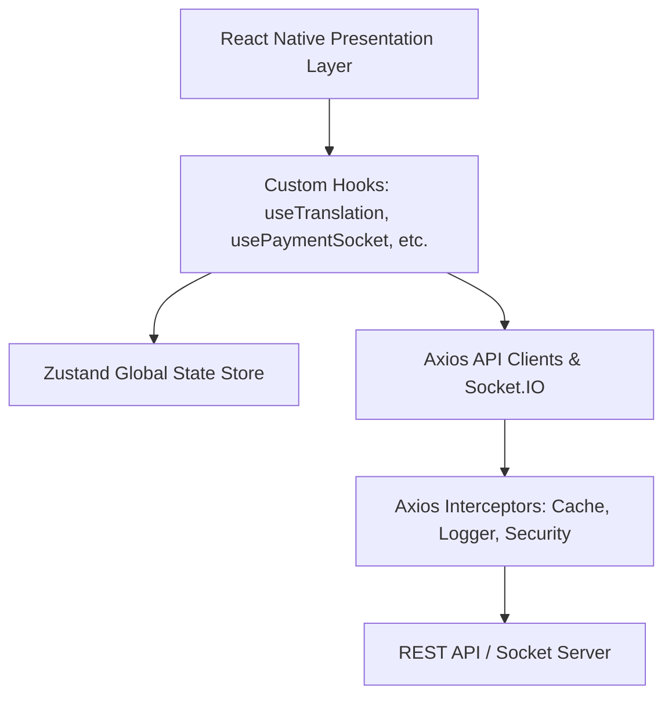

# DC Jewellers Mobile Application Wiki

Welcome to the official developer and architecture Wiki for the **DC Jewellers Mobile Application** (Android & iOS). This comprehensive documentation catalogs all features, architecture patterns, API integrations, and deployment pipelines implemented within the project.

---

## 📖 Wiki Table of Contents

Explore the documentation sections below to understand the application’s design and implementation details:

### 🌟 [1. Features & Modules](./Features-and-Modules.md)
A detailed breakdown of all user-facing features, modules, and screens, including:
*   **Authentication & Registration Flow** (OTP verification, MPIN creation, biometric login).
*   **Gold Savings Schemes** (Horizontal auto-scroll cards, joining savings, and chit balance tracking).
*   **Advance Gold Booking** (Gold rate locks, booking histories).
*   **Bill Payments** (Outstanding dues tracking, WebViews, socket-based status validation).
*   **Rewards & Referrals** (Point wallets, grouped referrals, Lucky Draw integration).
*   **Customer Support & FAQs** (FAQ chat bot, ticket filing, support contacts).

### 🛠️ [2. Technical Architecture](./Technical-Architecture.md)
An architectural deep-dive into the application’s design patterns, including:
*   **Project Structure**: Explaining the folder hierarchy inside `src/`.
*   **Tech Stack**: Expo SDK 54, React Native, Zustand, Nativewind v4, Socket.IO, and more.
*   **State Management**: Zustand global store design.
*   **API Client & Offline Fallbacks**: Axios client, request logger interceptors, caching helper, and continuous call prevention.
*   **Responsive UI & Typography**: Custom hooks (`useResponsiveLayout`) and scale functions (`hp`, `wp`, `rf`).
*   **Internationalization (i18n)**: 5-language dynamic translations engine (EN, TA, TE, HI, ML).

### 🔗 [3. API Reference Guide](./API-Reference.md)
The complete catalog of API endpoints utilized by the application:
*   13 categorized service modules.
*   Endpoint paths, HTTP methods, payloads, and file handlers.
*   Axios wrappers and async loader service configurations.

### 🚀 [4. Deployment, Build & Maintenance](./Deployment-and-Maintenance.md)
Guidelines and assets for building, deploying, and maintaining the app:
*   **EAS Build Configurations**: Injecting environment variables (such as Google Maps API keys) dynamically.
*   **Platform Integrations**: Custom Expo config plugins for iOS modular headers, UPI schema injection, and Android Proguard rules.
*   **App Lifecycle Controls**: App version verification, force updates, and maintenance mode controls.

---

## 🏛️ High-Level Project Architecture

The application is structured as a decoupled client-server architecture using Expo and React Native:

---

## 💻 Tech Stack Quick Reference

| Technology | Version | Description / Purpose |
| :--- | :--- | :--- |
| **Expo SDK** | `~54.0.36` | Mobile app core platform and navigation scaffolding |
| **React Native** | `0.81.5` | Native UI components & engine |
| **React Navigation** | `7.x` | Expo router tab and stack managers |
| **Zustand** | `^5.0.3` | Lightweight, performant global state management |
| **Axios** | `^1.7.9` | HTTP client for REST api integration |
| **Socket.io-Client** | `^4.8.1` | Real-time bi-directional payment status synchronization |
| **NativeWind** | `4.0.36` | TailwindCSS utility engine for styling |
