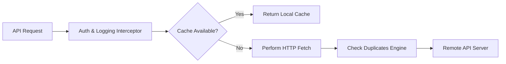

# Technical Architecture

This document outlines the core architecture, design patterns, file layout, and utilities powering the DC Jewellers Mobile Application.

---

## 📂 1. Directory Structure

The application follows a structured, modular design organized inside the `src/` directory:

```
├── src/
│   ├── @types/                 # Custom global TypeScript definitions
│   ├── __tests__/              # Automated unit and integration tests
│   ├── _styles/                # Styling variables and tailwind configs
│   ├── app/                    # Expo Router route files and navigators
│   │   ├── (auth)/             # Anonymous routes (login, register, OTP)
│   │   └── (app)/              # Authenticated session screens
│   │       └── (tabs)/         # Tab Bar Screens (home, savings, rewards)
│   ├── components/             # Reusable UI component cards and layouts
│   ├── config/                 # Static route configurations and links
│   ├── constants/              # Style assets, colors, and layout constants
│   ├── contexts/               # Custom React context hooks (e.g. alerts)
│   ├── hooks/                  # Custom React hooks (payments, responsive)
│   ├── locales/                # JSON translation bundles (5 languages)
│   ├── services/               # Axios REST APIs and socket listeners
│   ├── store/                  # Zustand state storage classes
│   ├── templates/              # HTML invoice design layouts
│   └── utils/                  # Cache managers, date utilities, formatters
```

---

## ⚡ 2. Core Technology Stack

*   **Platform Engine:** Expo SDK 54 (built on React Native 0.81.5).
*   **Routing System:** Expo Router v6 (React Navigation 7.x underneath).
*   **State Store:** Zustand v5.0.3 (manages caching, user data, and auth headers).
*   **Style Engine:** NativeWind v4 (TailwindCSS integration for React Native styling).
*   **HTTP Client:** Axios v1.7.9 (asynchronous REST requests).
*   **Realtime Sockets:** Socket.io-client v4.8.1 (real-time payment hooks).

---

## 🗄️ 3. Global State Management (Zustand)

Global state is managed via Zustand stores located in `src/store/`:
*   **`global.store.ts`**: Holds authentication tokens (`accessToken`, `refreshToken`), user profile data, language choices, and caching configurations. Automatically synchronizes critical tokens with secure local storage (`expo-secure-store`).
*   **`appState.ts`**: Manages volatile app state (loading dialog states, overlay indicators, network availability records, and visibility metrics).

---

## 🌐 4. Networking, Caching & Request Interceptors

The networking layer is built for resiliency and performance under weak cellular networks:



### Key Networking Components:
*   **Auth Interceptor (`services/networkInterceptor.ts`)**: Appends secure JWT bearer tokens dynamically. Refreshes expired sessions automatically via `/auth/refresh-token`.
*   **Offline Cache Manager (`utils/apiCache.ts`)**: Caches static responses (e.g., store directories, FAQs, system settings) locally in `AsyncStorage` to speed up transitions and preserve offline capability.
*   **API Performance Logger (`utils/apiLogger.ts` & `utils/logger.ts`)**: Tracks API load speeds and alerts when any background processes trigger redundant calls via `checkForContinuousCalls`.
*   **Double Loader Client (`services/apiWithLoader.ts`)**: Wraps critical blocking flows (e.g. booking rate lock, register submit) in a global loading overlay, forcing screen controls to freeze until execution finishes.

---

## 📱 5. Responsive Design & Layout Engine

To support various viewports across Android and iOS devices, sizing is managed dynamically:
*   **Responsive Scaling Helpers (`utils/responsiveUtils.ts`)**:
    *   `wp(percent)`: Computes actual width based on layout percentage.
    *   `hp(percent)`: Computes actual height based on layout percentage.
    *   `rf(fontSize)`: Generates responsive font-sizes adjusted for device pixel densities.
*   **Keyboard Handlers (`components/KeyboardAwareWrapper.tsx`)**: Auto-offsets inputs to prevent keyboard clipping.
*   **Custom Safe Area Hook (`hooks/useResponsiveLayout.ts`)**: Auto-calculates padding offsets dynamically to protect notches, status indicators, and home buttons on devices.

---

## 🗣️ 6. Five-Language Internationalization (i18n)

The application supports five languages: **English (EN), Tamil (TA), Telugu (TE), Hindi (HI), and Malayalam (ML)**.

*   **Locales Folder (`locales/`)**: Contains separate translation files for each language.
*   **Active Translate Hook (`hooks/useTranslation.ts` & `i18n.ts`)**: Evaluates language parameters and updates UI labels instantly when preferences change.
*   **Grid Fallback Engine (`utils/languageUtils.ts`)**: For languages with missing schema mappings (such as legacy Malayalam), the system automatically resolves and displays Tamil labels to avoid layout alignment issues.
